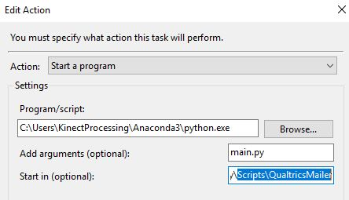

# Qualtrics Mailer
Process for automating survey emails with qualtrics
This script and process was made following [this tutorial](https://medium.com/kaianalytics/automating-surveys-with-python-qualtrics-api-and-windows-task-scheduler-4bffc58726d7) along with [Qualtrics API references](https://api.qualtrics.com/docs/code-to-send-sms-or-email-1)


### **MAKE SURE YOU HAVE QUALTRICS API ACCESS TO BE ABLE TO FIND IDs AND RUN SCRIPT**
### **PLEASE TEST WITH SAMPLE SURVEY, MESSAGE, AND MAILING LIST TO BE SURE THIS WORKS FOR YOU**

This procedure should require little to no programming experiece, but some knowedge of python may help with troublshooting. 

It was made using:
-  [Qualtrics API documentation](https://www.qualtrics.com/support/integrations/api-integration/overview/)
- [Python 3.7](https://www.python.org/downloads/release/python-371/)
- [Pycharm Community IDE](https://www.jetbrains.com/pycharm/download/)
- [Windows Task Scheduler](https://docs.microsoft.com/en-us/windows/desktop/taskschd/task-scheduler-start-page) (could also be accomplished with cron job on Linux system - if you would rather use that you will be able to apply these concepts)

The process invloves 3 basic parts
1. [Find Qualtric object IDs for survey, message, and mailing list](#1-qualtrics-object-ids)
2. [Add those ID strings to the python script](#2-qualtrics-object-ids-to-python-script)
3. [Set scheduled task to run script at scheduled time](#3-windows-task-scheduler)

EXTRA:
4. [How to send Qualtrics survey as a text message](#4-survey-as-text)

> This project assumes the windows machine that is set up for the automatic mailings will stay running to complete tasks, in the windows task scheduler setting there is an option to run if a task is missed. For best results of this automation it is best on a machine that stays on. (For cron job set up it could even be made to run on a raspberry pi). For future development of this automation I am looking at [google's cloud scheduler](https://cloud.google.com/scheduler/) but need to research security, cost, etc. I am open to any other options if you have recommendations

## 1. Qualtrics Object IDs
The survey, message, and mailing lists are already created in the qualtrics system so you don't need to create anything new. Just need to find the string ID references. 

1. Go into Qualtrics and sign on with your username and password as usual.
2. Click on the profile link in the top right corner and select ACCOUNT SETTINGS.


3. Select QUALTRICS IDs


4. Look at the API section, if you do not see a string of characters next to Token or do not see a "GENERATE TOKEN" button you will need to contact a study admin to get API access.
If you see the button but no string, click on the button


5. This page provides all of the Qualtrics Object IDs for adding into the python script.
- IDs that begin with SV_ are surveys
- IDs that begin with ML_ are mailing lists
- IDs that begin with UR_ GR_ are libraries


> This shows the Object ids associated with your profile. I actually set up a sample mailing list, survey, and message to test the automation. You may do the same to make sure this procedure works before mailing out to the entire list.


6. Usually the required mailing list and message IDs are under a group library (Mine are under the "Group Library: CART-Rush" but yours may be different)


- The mailing list under the Panels was the full maining list for the my CART project
- The "CART Weekly Update Survey" IDs was the message

7. Data Center is in the URL ```https://[DATA CENTER].qualtrics.com/Q/MyProjectsSection``` 
- not the whole url, just the part that between the "//" and ".qualtrics.com/..."

    

## 2. Qualtrics Object IDs to python script
> Clone or copy this repository to your system in a directroy you can remember as it will need to be referenced in the Windows Task Scheduler later

> I have included the virtual enviornment with all dependencies, so it _should_ work with little to no intervention

Add API token and data center to script [main.py](https://github.com/ttruty/QualtricsMailer/blob/master/main.py#L89-L90)
```python
# NEED TO SET
apiToken = '#########API TOKEN ###########' # hard coding API token for ease, but can set as env variable
dataCenter = '####### DATA CENTER ########' # will be the same across sites. 
```


Add the correct Object Ids to the python script in [main.py](https://github.com/ttruty/QualtricsMailer/blob/master/main.py#L40-L43)
```python
#qualtrics API object IDs
mailingListId = "ML_###############" # NEED TO SET
messageId = 'MS_###############'     # NEED TO SET
libraryId = 'GR_###############'     # NEED TO SET
surveyId = 'SV_###############'      # NEED TO SET
```

Change the mailer options in [main.py](https://github.com/ttruty/QualtricsMailer/blob/master/main.py#L54-L57)
```python
#NEED TO SET MAILER OPTIONS
header['fromEmail'] = "noreply@qualtrics.com"
header['fromName'] = "The CART team at [YOUR SITE]" # NEED TO SET
header['replyToEmail'] = "YOUR_EMAIL@site.edu"      # NEED TO SET
header['subject'] = "Weekly Health Update Form"     # CAN CHANGE
```

Once the script is complete you can actually just run it to send out the surveys to the mailing list if you wanted. (This is how you can test the script is working if you create a sample mailing list, message and survey) **Remeber to change back Qualtrics IDs if you do this**

## 3. Windows Task Scheduler
> I used a Windows 10, but should work on any Windows system.
1. Locate the Task Scheduler by searching for it at the start menu


2. On the Right Side of window click "CREATE TASK"


3. The task creation windows will open on the "general" tab first
- Give the task a name and description you will recognize
- Check the button to "Run whether user is logged on or not"
- Should not need root privileges


4. Next move to the "Triggers" tab and add a new trigger to run weekely


5. Next move to the "Actions" tab and add the python script
- Action should be "start a program"
- Program/script browse to the location of the python 3.6+ python.exe
- May under program files in the Windows(C:) drive, but may be in another location (I use Anaconda Python, you can always search for "python.exe" to find location or type "where python" in terminal).


- Arguments needs to by "main.py" (the name of the script to run)
- Start in needs to me the directory location of that script



6. In the settings check the setting to "Run after a scheduled start is missed"
- This should run when booted if computer was turned off during a scheduled distribution.


7. Click "OK" and you will need to enter the password and you should be all set up to have automatic distributions of qualtrics surveys

> *IT IS A GOOD IDEA TO TEST WITH A SAMPLE SURVEY, MESSAGE, AND MAILING LIST TO ENSURE THE DISTRIBUTION WORKS AT YOUR SITE BEFORE ROLLING OUT TO ALL PARTICIPANT*

## 4. Survey as Text
To send a survey link to a phone as a text message, most service carriers allow this for phone. Explained [here](https://20somethingfinance.com/how-to-send-text-messages-sms-via-email-for-free/).
> Make sure the participant requests this and that they will not be charged by thier provider for text messages 

> Tested by adding this email format instead of the email address, sender is from "noreply@qualrtics.com" or whatever the "fromEmail" is set as.
```
AT&T: number@txt.att.net (SMS), number@mms.att.net (MMS)
T-Mobile: number@tmomail.net (SMS & MMS)
Verizon: number@vtext.com (SMS), number@vzwpix.com (MMS)
Sprint: number@messaging.sprintpcs.com (SMS), number@pm.sprint.com (MMS)
XFinity Mobile: number@vtext.com (SMS), number@mypixmessages.com (MMS)
Virgin Mobile: number@vmobl.com (SMS), number@vmpix.com (MMS)
Tracfone: number@mmst5.tracfone.com (MMS)
Metro PCS: number@mymetropcs.com (SMS & MMS)
Boost Mobile: number@sms.myboostmobile.com (SMS), number@myboostmobile.com (MMS)
Cricket: number@sms.cricketwireless.net (SMS), number@mms.cricketwireless.net (MMS)
Republic Wireless: number@text.republicwireless.com (SMS)
Google Fi (Project Fi): number@msg.fi.google.com (SMS & MMS)
U.S. Cellular: number@email.uscc.net (SMS), number@mms.uscc.net (MMS)
Ting: number@message.ting.com
Consumer Cellular: number@mailmymobile.net
C-Spire: number@cspire1.com
Page Plus: number@vtext.com
```
> The surveys should be fine as a SMS as there is no need for images, only the clickable link needs to go through. (Tested on Google Fi, more testing will need to be done to validate it with more providers)